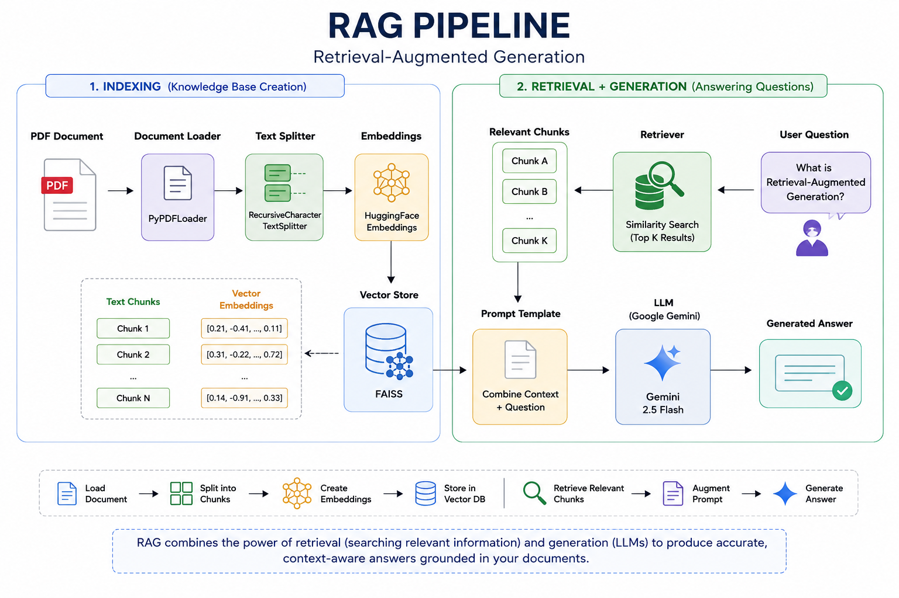

# 📚 LangChain Document Chat

A beginner-friendly implementation of **Retrieval-Augmented Generation (RAG)** using **LangChain**, **Google Gemini**, **FAISS**, and **HuggingFace Embeddings**.

This project demonstrates the complete RAG workflow—from loading a PDF document to retrieving relevant context and generating accurate answers using Google's Gemini LLM.

> 🚀 Built as part of my journey to learn **LangChain** and modern **RAG systems** from the ground up.

---

## 🏗️ RAG Architecture

<p align="center">
  
</p>

---

## 📖 Overview

Retrieval-Augmented Generation (RAG) enhances Large Language Models (LLMs) by retrieving relevant information from external documents before generating a response.

This project implements a complete RAG pipeline using modern LangChain components, making it a great starting point for learning document-based question-answering systems.

---

## 🚀 Features

- 📄 Load PDF documents using **PyPDFLoader**
- ✂️ Split documents into overlapping text chunks
- 🧠 Generate semantic embeddings using **HuggingFace Embeddings**
- 📦 Store embeddings in a **FAISS Vector Database**
- 🔍 Perform semantic similarity search
- 📑 Retrieve the most relevant document chunks
- 🤖 Generate context-aware answers with **Google Gemini**
- ⛓️ Build the pipeline using **LangChain**
- 💬 Ask natural language questions about your documents

---

## 🛠️ Tech Stack

| Component | Technology |
|-----------|------------|
| Programming Language | Python |
| Framework | LangChain |
| LLM | Google Gemini 2.5 Flash |
| Embedding Model | HuggingFace (`all-MiniLM-L6-v2`) |
| Vector Database | FAISS |
| Document Loader | PyPDFLoader |
| Text Splitter | RecursiveCharacterTextSplitter |
| Environment | Google Colab / Jupyter Notebook |

---

## 📂 Project Structure

```text
langchain-document-chat/
│
├── README.md
├── requirements.txt
├── .gitignore
├── langchain-document-chat.ipynb
│
├── data/
│   └── sample.pdf
│
└── images/
    └── architecture.png
```

---

## ⚙️ Installation

### 1. Clone the repository

```bash
git clone https://github.com/mahmudulhasantasin/langchain-document-chat

cd langchain-document-chat
```

### 2. Install dependencies

```bash
pip install -r requirements.txt
```

### 3. Configure your Google Gemini API Key

#### Linux / macOS

```bash
export GOOGLE_API_KEY="YOUR_API_KEY"
```

#### Windows (PowerShell)

```powershell
$env:GOOGLE_API_KEY="YOUR_API_KEY"
```

Alternatively, create a `.env` file:

```text
GOOGLE_API_KEY=YOUR_API_KEY
```

---

## ▶️ Running the Project

Open the notebook:

```text
langchain-document-chat.ipynb
```

Run all cells sequentially.

The notebook will:

1. Load the PDF document
2. Split the document into chunks
3. Generate vector embeddings
4. Create a FAISS vector database
5. Retrieve relevant document chunks
6. Build a prompt using the retrieved context
7. Generate the final answer with Google Gemini

---

## 💬 Example

### Question

```text
What is python?
```

### Answer

```text
Python is a general-purpose programming language in a similar vein to other programming languages that you might have heard of such as C++, JavaScript or Microsoft’s C# and Oracle ’s Java.
```

---

## 📚 Concepts Covered

- Retrieval-Augmented Generation (RAG)
- Document Loading
- Text Chunking
- Vector Embeddings
- Semantic Search
- FAISS Vector Database
- LangChain Retrievers
- Prompt Engineering
- Google Gemini Integration
- End-to-End Document Question Answering

---

## 🎯 Learning Outcomes

Through this project, I gained hands-on experience with:

- Understanding the RAG workflow
- Loading and preprocessing PDF documents
- Choosing effective chunking strategies
- Generating semantic embeddings
- Building and querying a FAISS vector database
- Retrieving relevant context using LangChain
- Integrating Google Gemini into a RAG pipeline
- Developing an end-to-end document question-answering system

---

## 🚀 Future Improvements

- 📚 Multi-document support
- 💬 Conversational RAG with chat history
- 🔎 Hybrid Search (BM25 + Vector Search)
- 🏷️ Metadata filtering
- 🌐 Streamlit web application
- ⚡ FastAPI backend
- 🐳 Docker support
- 🤖 Agentic RAG with LangGraph
- ☁️ Support for production vector databases (Chroma, Pinecone, Qdrant)

---

## 📌 Notes

- This project is intended for learning and experimentation.
- API keys are **not included** in the repository.
- Use your own **Google Gemini API Key** before running the notebook.
- Compatible with **Google Colab** and **Jupyter Notebook**.

---

## 🤝 Contributing

Contributions, suggestions, and improvements are welcome.

If you find a bug or have an idea for improvement, feel free to open an issue or submit a pull request.

---

## ⭐ Support

If you found this project helpful, consider giving it a ⭐ on GitHub.

It helps others discover the project and motivates future improvements.